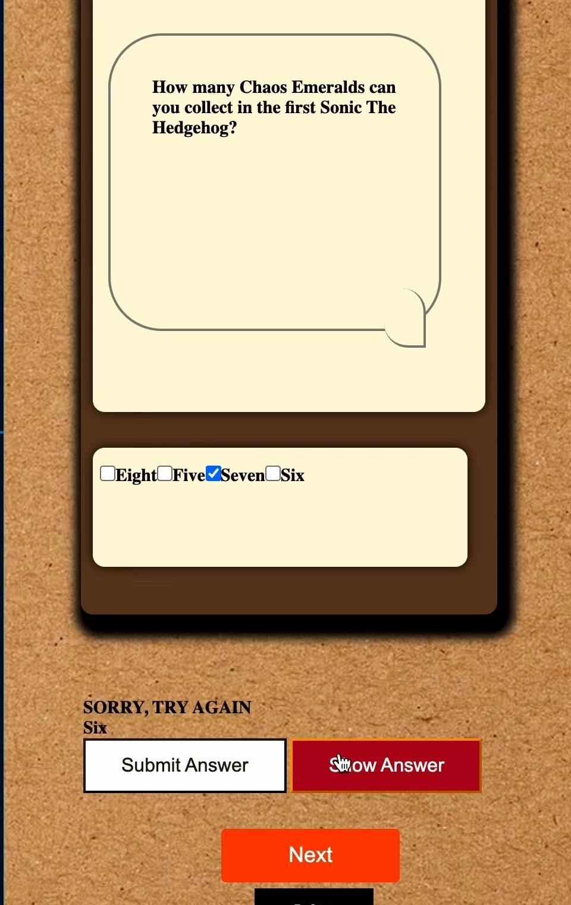

# Trivia Quiz Project

The Trivia Quiz Project is a two-page application designed from the [quiz api](https://opentdb.com/api_config.php)

[Tap to access the project here](https://diya-trivia-quiz.netlify.app)

### The Process

Tech Used: HTML, CSS, JavaScript, REST API

Firstly to enable user input, an input text element was created for players primarily to input their name on the first page of the application `index.html`, then the main page `main.html` that hold the trivia quiz in itself. The game has three levels: easy, medium and hard and the questions were shared according to their difficulty level. Input checkboxes was created in the script file to enable users select their desired level of questions. Buttons to fire a particular set of action were added for optimum userability of the application- The start button to begin the game, Next button to access the next question, clue/show answer button to reveal an answer from which points will be deducted, submit answer to submit the user checked option.

## Optimization
Since I was using three different urls for the game, Instead of using `Promise.all()` to fetch the urls before adding them to the easy, medium and hard options, I used conditionals to fetch the urls which was way easier and faster than the promise all method I initially used.

## Lessons Learnt

Had a lot of difficulty deactivating the Start button after first click; because I appended the checkbox element to the answer, onclick of the start button, the checkboxes in the answer section would keep on appending; had to deactivate the button after the first click. It was awesome when I finally got the Start button to dectivate the appending function after the first click.

